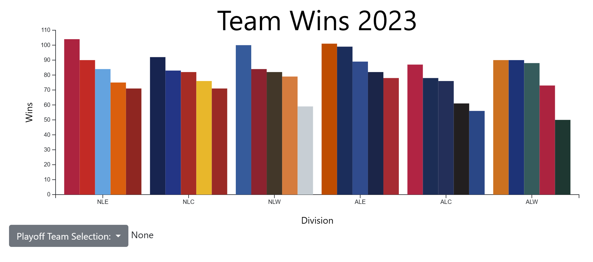
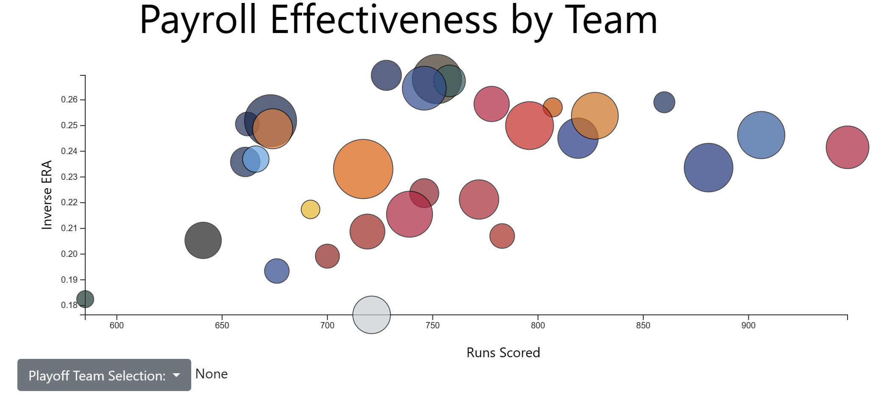
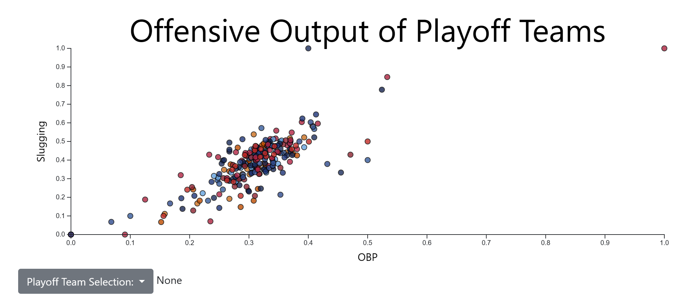

# Alexander-John-Sourish-Yonatan

## Title: MLB 2023 Postseason
Alex Burton, John Baker, Sourish Murphy, Yoni Rosenbloom

## Overview
</img>
Our project focused on analyzing the 2023 MLB Postseason. We noticed teams such as the New York Mets had huge payrolls but did not make the playoffs. In fact, many of the playoff teams were underdogs which resulted in the lowest combined wins in the World Series. We are interested in discovering why this happened through analyzing each team and players performance and looking at the numbers behind it all.

## Data Description
We used a couple different datasets for our project varying from player stats, team stats, and even team colors. Most of it was pulled from baseballreference.com, but for numerics like team salary we had to find other niche websites.

The attributes we used from these datasets were a combination of numerical and categorical. Categorical measures like a team’s league were helpful in visually grouping the playoff structure, but didn’t help us tell the story through numbers like we hoped to. Measures like OBP, ERA, derived Inverse ERA, Slugging and OPS were all numerics we used that were around the range of [0,1], while Wins was an integer value between 0 and 162. 

A lot of preprocessing had to be done before we had the data in a format usable for this project. The preprocessing was done by hand in a Microsoft Excel project, and included combining smaller spreadsheets, renaming columns, and imputing categorical data based on our knowledge of the league.
https://www.espn.com/mlb/standings
https://www.spotrac.com/mlb/payroll/2023/
https://www.baseball-reference.com/postseason/
https://www.baseball-reference.com/postseason/2023_NLCS.shtml?sr&utm_source=direct&utm_medium=Share&utm_campaign=ShareTool#post_batting_ARI

## Goal and Tasks 
Our goal was to discover why so many surprising teams made it to the playoffs when more skilled and wealthier teams did not. In order to do this, we needed to look at total wins for each team and compare them in their respective divisions and leagues. We compared the standings of the National League (NL) and American League (AL) teams. After analyzing each division and league, we needed to look at Runs Scored vs Inverse ERA to understand each team’s offensive and defensive capabilities with respect to their payroll. From there, we explored individual player’s Runs Scored and Slugging values to see their offensive skill. This had to be weighted by the number of games played to accurately show the player's performance throughout the full season. We then could look at overall OPS scores for each player to see how their performance changed over the course of the postseason. Some players performed very well leading to success in the postseason while others did not and we can see who did well on each team and hope it affected their standings and outcomes. Finally, we have a flow chart showing the progression of the teams throughout the season. We show who was able to make the playoffs, how the Wild Card ended, as well as Divisional Series and Championships all the way to the World Series.

## Idioms
The interface we built was a scrollytelling story comprised of the views enumerated below:
Viz 1 (Bar Plot) - The wins of each team was encoded in the height of the bar plot, while the categorical division was used to group them. This encoding gives a high level overview of each team’s capabilities over the entire season and gives them context into the remainder of the story we are trying to tell. The user has the option to hover over each bar and see which team had each win.

Viz 2 (Pie Chart) - The distribution of the playoff teams is encoded in the size and color of the pie chart. The exception to the general playoff criteria (the Seattle Mariners) is partitioned separately. The user can hover over each slice to see which teams compose each division, or get a better understanding of why the Mariners were excluded. This was done so that even if the reader had no prior understanding of baseball, they’d be able to follow along with the simple viz and continue building their context.

Viz 3 (Bubble Chart) - This viz plots each team’s pitching and hitting performance in comparison to their overall team spend. A team’s total runs are encoded in the X-Axis, inverse ERA in the Y-axis, and payroll in the point’s radius. We did this to show that not all teams share the same resources, and that the state of the playoffs actually defies intuition. By inverting the ERA, we hoped to give understanding to those who didn’t understand the stat because it places the ‘better’ teams in the upper half of the y axis. This is aligned with intuitive visual semantics. The user can hover over any given dot to see which team it is, and how much the owner is spending to maintain it.

Viz 4 (Scatter Plot) - This scatter plot further dives into a team’s composition and aims to discover whether the team’s performance is distributed evenly or reliant upon a few key players. This is a natural progression from the previous viz, and was selected to narrow down onto individual players for users who may not have any understanding of baseball. Getting into specific players becomes boring to those unfamiliar to the game, so we hoped that inserting this viz here would make the experience more enjoyable to everyone. The x-axis encodes a player’s OBP, the y-axis encodes their Slugging, and the color encodes which team it is. The user can scroll partially through the text to weigh the stats by the number of games the athlete played to give better insight into the overall value the player provided for their team throughout the season. They can also hover over each dot to see which specific player it is.

Viz 5 (Parallel Bars / Stacked Bar Chart) - This is our **innovative** viz, as it attaches a stacked bar chart to the axes of the parallel bars chart. In this viz, each line encodes a player’s OPS over the post-season and its color denotes their team. This is innovative because it lets the user see the effect of a Team’s offense in both a holistic and specific way at the same time. The ranges of the numerical OPS is between 0 and 3, and the scale's magnitude adjusts based on the extent of each series. The scales represented the categorical ‘series’ and were ordered chronologically according to when the series was played. The stacked bar plot showed the results of the series and how many runs the team proportionally earned, and were normalized to values between 0 and 1. This was done so that it could visually quantify the effective result of a team’s OPS for the specific series. The purpose of the chart was to show the user that each player may have over or under performed in relation to their regular season, and for that reason is why so many prominent teams failed to continue in the postseason. The user can interact with the viz by hovering over each line to see which player it represents or by selecting a specific team from the dropdown menu below the chart.

Viz 6 (Sankey Diagram) - This viz was meant to conclude our scrollytelling project and provide the user with the overall flow of the MLB post season. The nodes were colored to differentiate  the different stages of the MLB season, and the links were used to show how and when each team concluded their season. We did this as a concise way to wrap up the story we were trying to tell, while also providing the reader with context that may fill in some technical gaps we may have skipped.

## Reflection
Our project started off less glamorous than the final website. We had an idea of the visualizations we wanted to use but they were just drawings and we still needed to figure out the innovative visualizations. Our visualizations themselves did not change too much from start to finish, but it felt like the more we worked on it the more ambitious we got. We figured out how to weigh different metrics to show their true meaning, our innovative visualization mapped out each player’s performance through the postseason by team, we added lots of tooltips and the actual scrollytelling aspect of our project. The original proposal felt very attainable, but, as the project progressed, we became more and more ambitious wanting to show even more. However, the end goal was never out of reach and we were able to make an interactive site revealing how each team performed and why it happened. As with any great project in software, there were a few roadblocks. First and foremost was getting the scrollytelling to work. It was by far the most complex part of the project. However after laboring for days and countless tutorials and resources, we were able to get it working. We were actually able to implement most of our ideas for the visualizations and their interactivities. There were not many workarounds because we figured out everything after struggling through understanding it. Next time, we definitely would think about the final project more. We had an idea which luckily came to fruition through hard work, but a game plan for the full project would be nice to really flesh out our ideas first before we get into the coding part. 

## Team Workload
Sourish did the first visualization showing wins by team grouped by division. 

Yoni did the second and sixth visualization. He developed the tooltip that the remainder of the team implemented across their individual visualizations.

Alexander Burton did the third visualization showing a team’s offensive and defensive capabilities and related to their payroll. 

John Baker did the fourth and fifth visualizations and compiled the remainder of the team’s work into the scrollytelling format. He also did the data gathering and pre-processing.
 